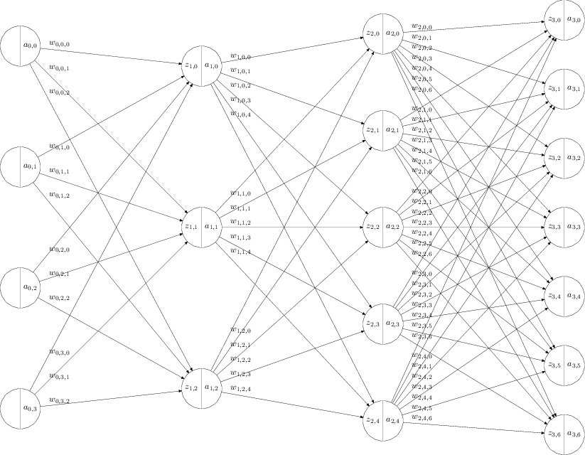

# 链式求导法则

单变量的复合函数

$$
\begin{align}
z &= z(y) \\
y &= y(x) \\
\frac{dz}{dx} &= \frac{dz}{dy} \frac{dy}{dx}
\end{align}
$$

多变量的复合函数

$$
\begin{align}
z &= f(u_1, u_2, ..., u_n) \\
u_i &= u_i(x) \\
\frac{dz}{dx} &= \sum_{i=1}^{n}\frac{dz}{du_i}\frac{du_i}{dx}
\end{align}
$$

# 神经网络建模

$$
\begin{align}
z_{l,j} &= b_{l,j} + \sum_{i=0}^{N_{l-1} -1 } w_{l-1,j,i} a_{l-1,i} \\
a_{l,j} &= \sigma(z_{l,j})
\end{align}
$$

其中
 - $L$ 为神经网络的层数，包含输入层，包含输出层。上面的例子中是 4 层神经网络
 - $l = 0,...,L-1$ 是层的下标
 - $N_{l}$ 是第 $l$ 层神经网络的神经元的个数
 - $j = 1, ..., N_{l}$ 每一次的第 $j$ 个神经元的下标
 - $z_{l,j}$ 是第 $l$ 层神经网络中，第 $j$ 个神经元的 sigmoid 函数的输入。
 - $a_{l,j}$ 是第 $l$ 层神经网络中，第 $j$ 个神经元的 sigmoid 函数的输出。特别的，当 $l=1$ 时， $a_{0,i}$ 表示输入层，$N_0$ 表示输入层的个数。
 - sigmoid 函数可以是，例如
    $$\sigma(x) = \frac{1}{1+e^{-x}}$$
 - $w_{l-1,j,i}$ 是第 $l-1$ 层中第 $i$ 个输出和 $l$ 层的第 $j$ 个输入之间的权值。
 - $b_{l,i}$ 是第 $l$ 层中第 $j$ 个神经元的偏移量

# back propagation

## 目的

给定一个训练样本 $a_{0,j}$, 和期待的输出 $y_{k}$, $k=1...N_{L-1}$ 。

$a_{0,j}$ 这个数学符号，$0$ 表示第零层，即输入层。$j =1...N_{0}$ 表示第 $0$ 层有 $N_{0}$ 个神经元

定义成本函数如下

$$C = \frac{1}{2} \sum_{k=0}^{N_L - 1} (y_{k}-a_{L-1,k})^2$$

那么，问题就是，如何选取一组 $w_{l,j,i}$ 和 $b_{l,i}$ ，使得 $C$ 最小。

## 解决方案

梯度降低的方法，随机选取一组答案，然后沿着梯度方向，即 $\frac{\partial{C}}{\partial{w_{l-1,j,i}}}$ 和 $\frac{\partial{C}}{\partial{b_{l,j}}}$ ，减小。逐步找到合适的答案，$w_{l-1,j,i}$ 和 $b_{l,i}$ 。

那这里的问题就是，如何求 $\frac{\partial{C}}{\partial{w_{l-1,j,i}}}$ 和 $\frac{\partial{C}}{\partial{b_{l,j}}}$ ？

## 推导

如果定义

$$\delta_{l,j}= \frac{\partial{C}}{\partial{z_{l,j}}}$$

$\delta_{l,j}$ 的含义就是，如果神经元输入 $z_{l,j}$ 变化一点点，会导致成本函数 $C$ 变化多少？

因为

$$ z_{l,j} = b_{l,j} + \sum_{i=0}^{N_{l-1} -1 } w_{l-1,j,i} a_{l-1,i} $$

$w_{l-1,j,i}$ 变化一点点，会导致 $z_{l,j}$ 变化 $a_{l-1,j}$ 倍。

$b_{l,j}$ 变化一点点，会导致 $z_{l,j}$ 变化 同样的比例。

根据链式求导法则，就得出了下面的公式。

$$
\begin{align}
\frac{\partial{C}}{\partial{w_{l-1,j,i}}} &= \delta_{l,j} a_{l-1,i} \\
\frac{\partial{C}}{\partial{b_{l,j}}} &= \delta_{l,j}
\end{align}
$$

那么现在的关键是如何求 $\delta_{l,j}$

因为
$$C = \frac{1}{2} \sum_{k=0}^{N_{L-1}-1} (y_{k}-a_{L-1,k})^2$$

考虑第 L - 1 层，即最后一层。

$$\delta_{L-1,j}= \frac{\partial{C}}{\partial{z_{L-1,j}}}$$

根据链式求导法则

$$\delta_{L-1,j}= \frac{\partial{C}}{\partial{a_{L-1,j}}}\frac{\partial{a_{L-1,j}}}{\partial{z_{L,j}}}$$

$$\delta_{L-1,j}= (a_{L-1,j} - y_j) \frac{\partial{a_{L-1,j}}}{\partial{z_{L-1,j}}}$$

这样，我们得到了最后一层的 $\delta_{L-1,j}$。

我们递归的向后回溯，假设已知所有 $\delta_{l,j}$ ，如果求 $\delta_{l-1,j}$ 。

$$\delta_{l-1,j}= \frac{\partial{C}}{\partial{z_{l-1,j}}}$$

根据链式求导法则
$$
\begin{align}
\delta_{l-1,j} &= \sum_{i=0}^{N_{l} -1}
                  \frac{\partial{C}}{\partial{z_{l,i}}}
                  \frac{\partial{z_{l,i}}}{\partial{a_{l-1,j}}}
                  \frac{\partial{a_{l-1,j}}}{\partial{z_{l-1,j}}} \\
              &= \sum_{i=0}^{N_{l} -1}
                  \delta_{l,i}
                  \frac{\partial{z_{l,i}}}{\partial{a_{l-1,j}}}
                  \frac{\partial{a_{l-1,j}}}{\partial{z_{l-1,j}}} \\
              &= \sum_{i=0}^{N_{l} -1}
                  \delta_{l,i}
                  w_{l-1,j,i}
                  \frac{\partial{a_{l-1,i}}}{\partial{z_{l-1,j}}}
\end{align}
$$

上述公式的理解就是，第 $l -1 $ 层的输入 $z_{l-1,j}$ 的变化，会导致成本 $C$ 变化多少呢？
根据链式求导法则，这个 $C$ 的变化量，会分散传导至第 $l$ 层。第 $l$ 层每个神经元分摊到的成本变化量是和 $w_{l-1,j,i}$ 成正比，也和 sigmod 函数的变化率成正比。
