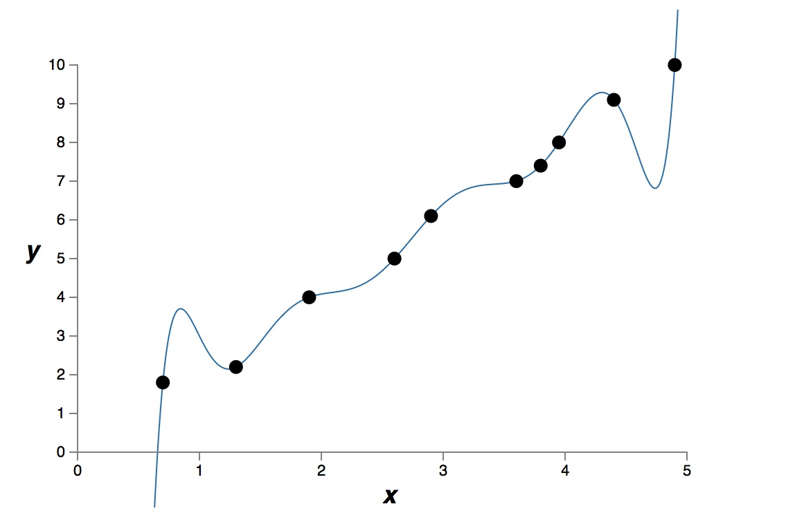
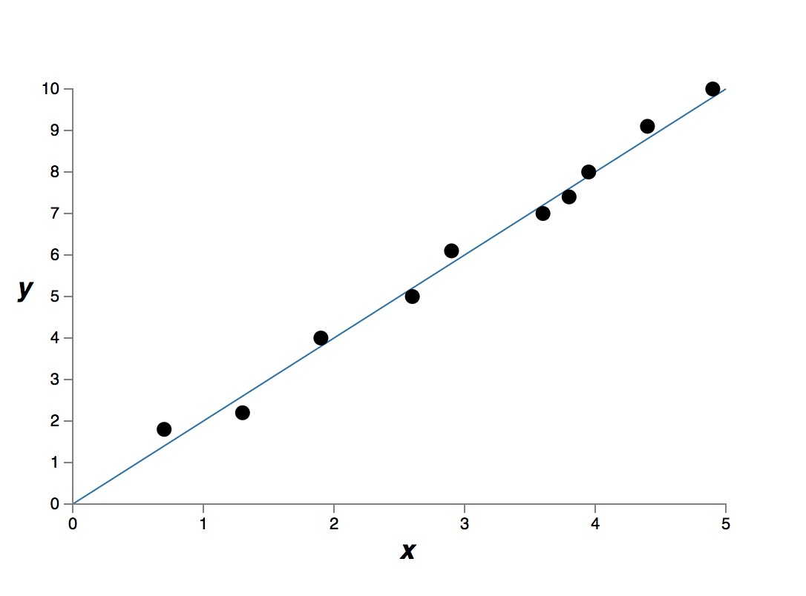

本文参考 [http://neuralnetworksanddeeplearning.com/chap3.html]()

过拟合和正则化(Overfitting and regulation)

# 模型中自由参数的个数

通常来说，自由变量的个数越多，模型的表达能力越强。例如下面的一些原始测量点。

假设我们有两种模型，一种是九次多项式模型

$$ y = a_0 + a_1 x + a_2 x^2 + \cdots + a_9 x^9 $$

另一种是简单的线性模型，即，一次多项式模型

$$ y = a_0 + a_1 x  $$

我们得到下面两个结果。

九次模型的拟合结果

一次模型的拟合结果

很明显，9次模型比1次模型的表达能力更强，“表达能力更强”是一个不严谨的说法，意味着这个模型可以记住所有的训练数据。9次模型有 10 个自由参数，可以“记住”更多的训练数据。如果严格数学上描述“表达能力更强”，我理解是指，这个模型可以把成本函数优化到很低很低，也就是说，能很好的拟合所有训练数据。

如果我们真正使用训练好的模型，用模型来预测未知的数据，这时我们很难说“表达能力强”的模型的预知能力更好。

具体哪个模型更好，其实是没有答案的，取决于哪一个建模更加接近真实的模型。假设上面的测量数据，就是一个线性模型的测量结果，那么1次模型，就是更好的建模。通常，如果没有特别的原因，我们倾向使用更简单的模型。

测量的原始数据是有测量误差的，而9次模型严格拟合了所有训练数据，把测量误差也当做真实模型的有用信息了。这就是过拟合。

建模的过程中，自由参数 (free parameters) 的个数是一个很重要的量。就算一个模型可以很好的拟合训练数据，但如果自由参数的数量不够的话，那么这个模型也有可能不是一个很好的模型。自有参数的个数太多也不好，因为会出现过拟合的现象。因为他有可能只是说只针对训练数据有效。真正使用的时候，就哑火了。

这种过拟合，就是说成本函数看起来已经很小了，似乎模型训练的很好，但是实际的预测率却上不去。

# 训练样本的数量和自由参数的个数

过拟合的本质是过度拟合了噪声，或者测量误差。而不是现实模型的本质。
所以，有的时候，成本函数变得很小，区分率并没有得到提高，原因是我们过分匹配了训练数据，而训练数据中，我们无法区分测量误差和噪声，这样就导致我们的模型似乎只是记住了训练数据，只有针对训练数据表现的很好，但是碰到了真实数据，就哑火了。

解决这个问题的办法就是提高训练样本的个数，让训练样本的个数远远超过自有参数的个数。就像上面的例子，如果有1000 个测量点，如果真实数据的确是线性关系的话，我相信 9 次模型也能收敛到 1次模型上。

实际上，训练数据很贵或者很难得到。而且训练样本增多，训练时间也变得很长很长。

但是当训练样本个数小于或者接近自有参数的个数的时候，过拟合就问题就很明显了。

# 精确建模，从而减少自有参数的个数

通过精确的建模，我们也可以防止过拟合的问题，模型中的自由参数都是精准设计的。

精确建模减少了自有参数的个数，不仅解决了过拟合的问题，同时也提高了模型的预测能力。

实际上，这个也是不切实际的，有些问题是如此的复杂，以至于我们几乎无法做精确的建模。

# 正则化

正则化 (regulation) 是一种减少过拟合的方法。

## $L^2$ 正则化，权值退化

我们盯着本质模型仔细看一会儿

$$z = w \hat a + b$$

下一级的输入是上一级输出的线性变换。假设我们的测量数据 $\hat a$ 中有我们不可知的误差，假设是加性的误差，那么 $\hat a = a + e$

$$z = w(a+e) + b$$

可以看到 $w$ 放大了这种误差，无论这个误差是加性的，还是其他。

如果我们假定 $w$ 很小，这样就减少了放大误差的可能性。

体现真相的 $a$ 会在很多训练数据中重复出现，所有的 $w$ 都很小，其实本质上不影响我们的模型训练，只不过是同比例放大缩小。

体现误差的 $e$ 对于每一个训练数据都不一样，某一个单一的训练样本的误差，不会对训练模型有很大影响。

注意这里面没有偏移量啥事，因为偏移量没有和测量误差没有关系。

$L^2$ 正则化，在成本函数中增加一个新的项。

$$ \frac{\lambda}{2n} \sum_w w^2$$

$\lambda$ 是正则化参数。

这一项说明，权值越大，成本越大。可见，我们希望有绝对值很小的权值。除非我们有大量的样本 $n$ ，否则我们希望权值越小越好。

可以看到，我们希望用很小的权值来最小化的成本函数的同时，$\lambda$ 用于寻找一种平衡，是减小权值更重要呢？还是最小化成本函数最重要？

## L1 正则化

$$\frac{\lambda}{n} \sum_w |w|$$

L1 的正则化看上去和 L2 十分类似，设计初衷也是一样的，区别是 L1 和 L2 的权值退化程度不一样。 L1 的权值退化速度是一个常量，而且向 0 逼近。而 L2 的权值退化速度和 $w$ 成正比，$w$ 越大，退化速度越大。

这样 L1 的效果是，网络模型中会留下少数几个比较重要的权重。而其他不重要的权重，都趋近于 0 了。

## dropout 正则化

dropout 正则化不是修改成本函数的表达方式，他修改神经网络本身。

上面的讨论中，我们可以看到，减少自由参数的个数，让他和训练样本的个数差不多，或者远远小于训练样本的个数，这样就可以减少过拟合。

dropout 的方法利用这一点，每次训练权值的时候，随机选取一部分神经元，这样做之后，导致每次训练权值的时候，其实模型中的参数个数没有那么多。

每次训练都是随机选取模型中的一个子集，这样某一特定样本就不会对整个模型产生十分大的影响。
