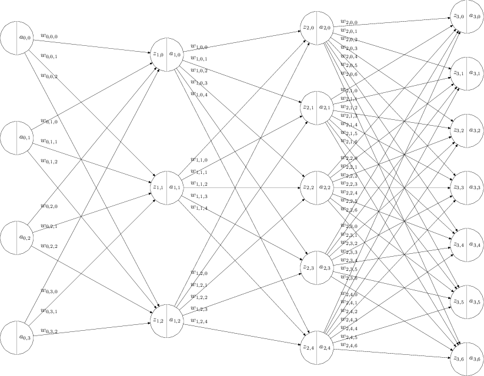

# "backpropagation"

# 链式求导法则

单变量的复合函数

\\(
\begin{align}
z &= z(y) \\
y &= y(x) \\
\frac{dz}{dx} &= \frac{dz}{dy} \frac{dy}{dx}
\end{align}
\\)

多变量的复合函数

\\(
\begin{align}
z &= f(u _ 1, u _ 2, ..., u _ n) \\
u _ i &= u _ i(x) \\
\frac{dz}{dx} &= \sum _ {i=1}^{n}\frac{dz}{du _ i}\frac{du _ i}{dx}
\end{align}
\\)

# 神经网络建模

\\(
\begin{align}
z _ {l,j} &= b _ {l,j} + \sum _ {i=0}^{N _ {l-1} -1 } w _ {l-1,j,i} a _ {l-1,i} \\
a _ {l,j} &= \sigma(z _ {l,j})
\end{align}
\\)

其中

 - \\(L\\) 为神经网络的层数，包含输入层，包含输出层。上面的例子中是 4 层神经网络
 - \\(l = 0,...,L-1\\) 是层的下标
 - \\(N _ {l}\\) 是第 \\(l\\) 层神经网络的神经元的个数
 - \\(j = 1, ..., N _ {l}\\) 每一次的第 \\(j\\) 个神经元的下标
 - \\(z _ {l,j}\\) 是第 \\(l\\) 层神经网络中，第 \\(j\\) 个神经元的 sigmoid 函数的输入。
 - \\(a _ {l,j}\\) 是第 \\(l\\) 层神经网络中，第 \\(j\\) 个神经元的 sigmoid 函数的输出。特别的，当 \\(l=0\\) 时， \\(a _ {0,i}\\) 表示输入层，\\(N _ 0\\) 表示输入层的个数。
 - sigmoid 函数可以是，例如
    \\(\sigma(x) = \frac{1}{1+e^{-x}}\\)
 - \\(w _ {l-1,j,i}\\) 是第 \\(l-1\\) 层中第 \\(i\\) 个输出和 \\(l\\) 层的第 \\(j\\) 个输入之间的权值。
 - \\(b _ {l,i}\\) 是第 \\(l\\) 层中第 \\(j\\) 个神经元的偏移量

# back propagation

## 目的

给定一个训练样本 \\(a _ {0,j}\\), 和期待的输出 \\(y _ {k}\\), \\(k=1...N _ {L-1}\\) 。

\\(a _ {0,j}\\) 这个数学符号，\\(0\\) 表示第零层，即输入层。\\(j =1...N _ {0}\\) 表示第 \\(0\\) 层有 \\(N _ {0}\\) 个神经元

定义成本函数如下

\\(C = \frac{1}{2} \sum _ {k=0}^{N _ L - 1} (y _ {k}-a _ {L-1,k})^2\\)

那么，问题就是，如何选取一组 \\(w _ {l,j,i}\\) 和 \\(b _ {l,i}\\) ，使得 \\(C\\) 最小。

## 解决方案

梯度降低的方法，随机选取一组答案，然后沿着梯度方向，即 \\(\frac{\partial{C}}{\partial{w _ {l-1,j,i}}}\\) 和 \\(\frac{\partial{C}}{\partial{b _ {l,j}}}\\) ，减小。逐步找到合适的答案，\\(w _ {l-1,j,i}\\) 和 \\(b _ {l,i}\\) 。

那这里的问题就是，如何求 \\(\frac{\partial{C}}{\partial{w _ {l-1,j,i}}}\\) 和 \\(\frac{\partial{C}}{\partial{b _ {l,j}}}\\) ？

## 推导

如果定义

\\(\delta _ {l,j}= \frac{\partial{C}}{\partial{z _ {l,j}}}\\)

\\(\delta _ {l,j}\\) 的含义就是，如果神经元输入 \\(z _ {l,j}\\) 变化一点点，会导致成本函数 \\(C\\) 变化多少？

因为

\\( z _ {l,j} = b _ {l,j} + \sum _ {i=0}^{N _ {l-1} -1 } w _ {l-1,j,i} a _ {l-1,i} \\)

\\(w _ {l-1,j,i}\\) 变化一点点，会导致 \\(z _ {l,j}\\) 变化 \\(a _ {l-1,j}\\) 倍。

\\(b _ {l,j}\\) 变化一点点，会导致 \\(z _ {l,j}\\) 变化 同样的比例。

根据链式求导法则，就得出了下面的公式。

\\(
\begin{align}
\frac{\partial{C}}{\partial{w _ {l-1,j,i}}}
   &= \frac{\partial{C}}{\partial{z _ {l,j}}}
      \frac{\partial{z _ {l,j}}}{\partial{w _ {l-1,j,i}}} \\
   &= \delta _ {l,j} a _ {l-1,i}
\end{align}
\\)

类似的

\\(
\begin{align}
\frac{\partial{C}}{\partial{b _ {l,j}}}
&= \frac{\partial{C}}{\partial{z _ {l,j}}}
   \frac{\partial{z _ {l,j}}}{\partial{b _ {l,j}}} \\
&= \delta _ {l,j}
\end{align}
\\)

那么现在的关键是如何求 \\(\delta _ {l,j}\\)

思路类似于自然归纳法，就是先求 \\(\delta _ {L-1,j}\\) ，然后假设已知所有 \\(\delta _ {l,j}\\) ，如果求 \\(\delta _ {l-1,j}\\) 。

首先考虑第 \\(L - 1\\) 层，即最后一层。

\\(
\begin{align}
C &= \frac{1}{2} \sum _ {k=0}^{N _ {L-1}-1} (y _ {k}-a _ {L-1,k})^2 \\
\delta _ {L-1,j}
 &= \frac{\partial{C}}{\partial{z _ {L-1,j}}}
\end{align}
\\)

根据链式求导法则

\\(
\begin{align}
\delta _ {L-1,j} &=
\frac{\partial{C}}{\partial{a _ {L-1,j}}}
\frac{\partial{a _ {L-1,j}}}{\partial{z _ {L-1,j}}} \\
&=(a _ {L-1,j} - y _ j)
\sigma'(z _ {L-1,j})
\end{align}
\\)

这样，我们得到了最后一层的 \\(\delta _ {L-1,j}\\)。

我们递归的向后回溯，假设已知所有 \\(\delta _ {l,j}\\) ，如果求 \\(\delta _ {l-1,j}\\) 。

\\(\delta _ {l-1,j}= \frac{\partial{C}}{\partial{z _ {l-1,j}}}\\)

根据链式求导法则
\\(
\begin{align}
\delta _ {l-1,j} &= \sum _ {i=0}^{N _ {l} -1}
                  \frac{\partial{C}}{\partial{z _ {l,i}}}
                  \frac{\partial{z _ {l,i}}}{\partial{a _ {l-1,j}}}
                  \frac{\partial{a _ {l-1,j}}}{\partial{z _ {l-1,j}}} \\
              &= \sum _ {i=0}^{N _ {l} -1}
                  \delta _ {l,i}
                  \frac{\partial{z _ {l,i}}}{\partial{a _ {l-1,j}}}
                  \frac{\partial{a _ {l-1,j}}}{\partial{z _ {l-1,j}}} \\
              &= \sum _ {i=0}^{N _ {l} -1}
                  \delta _ {l,i}
                  w _ {l-1,j,i}
                  \sigma'(z _ {l-1,j})
\end{align}
\\)

上述公式的理解就是，第 \\(l -1 \\) 层的输入 \\(z _ {l-1,j}\\) 的变化，会导致成本 \\(C\\) 变化多少呢？
根据链式求导法则，这个 \\(C\\) 的变化量，会分散传导至第 \\(l\\) 层。第 \\(l\\) 层每个神经元分摊到的成本变化量是和 \\(w _ {l-1,j,i}\\) 成正比，也和 sigmoid 函数的变化率成正比。
